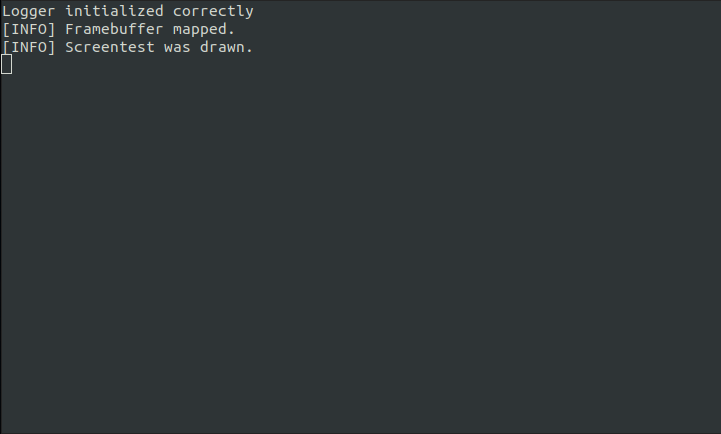

+++
title = "CLUU (Compact Lightweight Unix Utopia)"
date = 2023-06-14

[extra]
authors = ["valibali"]
+++

  

CLUU is a hobby operating system being written in Rust - in the active development phase - targeting x86_64 and with plans to support aarch64 in the future. The project is made for **fun and joy**, drawing inspiration from various operating systems and projects while incorporating unique approaches and ideas.

## Motivation

CLUU is driven by the motivation to explore operating system development in a powerful language like Rust. The project seeks to break away from the traditional approach using languages like C, which can sometimes feel limiting or mundane. With CLUU, the goal is to embark on a learning journey and have fun in the process. Contributions from the community are highly encouraged and welcomed.

## Project Information

CLUU draws inspiration from the following operating systems:

- [Plan 9](https://github.com/plan9foundation/plan9): Plan 9 from Bell Labs is a distributed operating system developed at Bell Labs in the late 1980s. It provides a unique approach to system organization, with a focus on simplicity and distributed computing.
- [BSD](https://github.com/freebsd/freebsd): FreeBSD is a modern, advanced operating system for x86 and ARM architectures. It offers a rich feature set and has a long history of stability and reliability.

As well as heavily influenced by the following projects:

- [RedoxOS](https://github.com/redox-os/redox): RedoxOS is an operating system written in Rust, aiming to bring the innovations of Rust to a modern microkernel and full set of applications. It's fair to say it is the most advanced of all Rust OS-es.
- [k4dos](https://github.com/clstatham/k4dos): k4dos is another hobby-os of that sort, it's fairly cool, with userspace, that can run FreeDoom for example. It has a nice shell implementation: kash
- [blog_os](https://os.phil-opp.com/): blog_os is a cutting-edge project by Philipp Oppermann that provides a detailed tutorial on building an operating system in Rust. It covers various aspects, including the bootloader, memory management, and device drivers.

CLUU aims to create a UNIX-like operating system, although not plannig to fully adhere to the POSIX standards. The goal is to get as close to the UNIX philosophy and compatibility as possible. This would enable easier porting of Linux software to CLUU and provide a familiar environment for developers.

## Current State and Goals

CLUU is currently in the early stages of development, with the focus on building a solid foundation for the operating system. At this stage, the following basic functionalities have been implemented:

- **UART16550 driver**: A driver for UART16550, allowing communication with the serial port for debugging and logging purposes.
- **Preparation for PIO and MMIO**: The groundwork has been laid for implementing both Programmed I/O (PIO) and Memory-Mapped I/O (MMIO) for interacting with hardware devices.
- **Framebuffer driver**: A driver for the framebuffer, providing a graphical output display.
- **Simple graphics and writing**: Basic graphical capabilities have been implemented, allowing for drawing and writing on the screen using a PSF font.
- **Basic Logging framework**: A basic logging framework has been developed to facilitate debugging and information output during the development process.

 

As the project progresses, the focus will shift towards implementing additional features, such as:

- **Kernel Implementation**: Further development of the microkernel's core functionality, including process management, interprocess communication, and resource management.
- **Device Drivers**: Continued development of drivers for essential hardware components, including keyboard, storage devices, and other peripherals.
- **Filesystem Support**: Introducing filesystem support to enable file I/O operations and provide a foundation for user-level processes and applications.

The project remains open-source, and contributions from the community are highly encouraged. If you're interested in exploring the code, contributing enhancements, or reporting issues, please visit the [GitHub repository](https://github.com/valibali/cluu).

## License

CLUU is licensed under the MIT License. See [LICENSE](https://github.com/valibali/cluu/blob/master/LICENSE) for more information.
