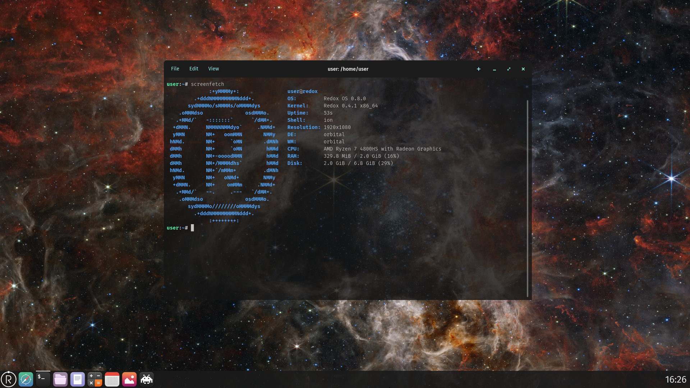

+++
title = "Redox OS"
date = 2024-06-19
aliases = ["showcase/redox-os"]

[extra]
authors = ["Ribbon", "Ron Williams"]
+++

Redox OS is a microkernel-based general-purpose operating system with a focus on security, stability, reliability, correctness and pragmatism.

The project was born in 2015 as an attempt to create the first operating system written in Rust (after the 1.0 version of the compiler), since then it was rewritten from unikernel to a microkernel and matured.

Other concepts were introduced by the contributors, like a Plan 9-like system interface and sandboxing by default using the Capsicum capabilities from FreeBSD.

## Microkernels

The Redox kernel is a microkernel. Microkernels stand out in their design by providing minimal abstractions in kernel-space. Microkernels focus on user-space, unlike Monolithic kernels which focus on kernel-space.

The basic philosophy of microkernels is that any component which *can* run in user-space *could* run in user-space. Kernel-space should only be utilized for the most essential components (e.g., system calls, process separation, resource management, IPC, thread management, etc).

The kernel's main task is to act as a medium for communication and segregation of processes. The kernel should provide minimal abstraction over the hardware (that is, drivers, which can and should run in user-space).

Microkernels are more secure and less prone to crashes than monolithic kernels. This is because most kernel components are moved to user-space and use different memory address spaces, and thus can't do damage to the system. Furthermore, microkernels are extremely maintainable, due to their small code size the number of bugs in the kernel is reduced a lot.

As anything else, microkernels do also have disadvantages.

## Advantages of microkernels

There are quite a lot of advantages (and disadvantages) with microkernels, a few of which will be covered here.

### Better Modularity and Configuration

Monolithic kernels are, well, monolithic. They do not allow fine-grained control as microkernels. This is due to many essential components being "hard-coded" into the kernel, and thus requiring modifications to the kernel itself (e.g., device drivers).

Microkernels are very modular by nature. You can replace, reload, modify, change, and remove modules, on runtime, without even touching the kernel.

Modern monolithic kernels try to solve this issue using kernel modules but still often require the system to reboot.

### Better Security

Microkernels are undoubtedly more secure than monolithic kernels. The minimality principle of microkernels is a direct consequence of the principle of least privilege, according to which all components should have only the privileges absolutely needed to provide the needed functionality.

Many security-critical bugs in monolithic kernels comes from services and drivers running unrestricted in kernel mode, without any form of protection.

In other words: **in monolithic kernels, drivers can do whatever they want, without restrictions, when running in kernel mode**.

### Better Stability

When compared to microkernels, Monolithic kernels tend to be crash-prone. A buggy driver in a Monolithic kernel can crash the whole system because the driver code is running on the same memory address space of the kernel, thus the kernel process can't continue to run (to avoid memory corruption) and crash (kernel panic).

While in a microkernel the drivers run in different memory address spaces (separation of concerns) which allows the system to handle any crash safely.

In Linux we often see errors with drivers dereferencing bad pointers which ultimately results in kernel panics.

There is very good documentation in [MINIX](http://wiki.minix3.org/doku.php?id=www:documentation:reliability) about how this can be addressed by a microkernel.

### Sane Debugging

In microkernels the kernel components (drivers, filesystems, etc) are moved to user-space, thus bugs on them don't crash the kernel.

This is very important to debug in real hardware, because if a kernel panic happens, the log can't be saved to find the root of the bug.

In monolithic kernels, a bug in kernel component will cause a kernel panic and lock the system (if it happens in real hardware, you can't debug without serial output support)

(Buggy drivers are the main cause of kernel panics)

## Disadvantages of microkernels

### Small Performance Overhead

Any modern operating system needs basic security mechanisms such as virtualization and segmentation of memory. Furthermore any process (including the kernel) has its own stack and variables stored in registers. On [context switch](https://en.wikipedia.org/wiki/Context_switch), that is each time a system call is invoked or any other inter-process communication (IPC) is done, some tasks have to be done, including:

- Saving caller registers, especially the program counter (caller: process invoking syscall or IPC)
- Reprogramming the [MMU](https://en.wikipedia.org/wiki/Memory_management_unit)'s page table (aka [TLB](https://en.wikipedia.org/wiki/Translation_lookaside_buffer))
- Putting CPU in another mode (kernel mode and user mode, also known as ring 0 and ring 3)
- Restoring callee registers (callee: process invoked by syscall or IPC)

These are not inherently slower on microkernels, but microkernels need to perform these operations more frequently. Many of the system functionality is performed by user-space processes, requiring additional context switches.

The performance difference between monolithic and microkernels has been marginalized over time, making their performance comparable. This is partly due to a smaller surface area which can be easier to optimize.

- [Context switch documentation](https://wiki.osdev.org/Context_Switching)
- [Microkernels performance paper](https://os.inf.tu-dresden.de/pubs/sosp97/)

We are working on exciting performance optimizations to minimize the overhead of extra context switches.

## Versus monolithic kernels

Monolithic kernels provide a lot more abstractions than microkernels.

The above illustration from [Wikimedia](https://commons.wikimedia.org/wiki/File:OS-structure.svg), by Wooptoo, License: Public domain) shows how they differ.

## Documentation about the kernel/user-space separation

- [Dual Mode operations in OS](https://www.geeksforgeeks.org/dual-mode-operations-os/)
- [User mode and Kernel mode switching](https://www.geeksforgeeks.org/user-mode-and-kernel-mode-switching/)

## Documentation about microkernels

- [OSDev technical wiki](https://wiki.osdev.org/Microkernel)
- [Message passing documentation](https://wiki.osdev.org/Message_Passing)
- [Minix documentation](https://wiki.minix3.org/doku.php?id=www:documentation:start)
- [Minix features](https://wiki.minix3.org/doku.php?id=www:documentation:features)
- [Minix reliability](https://wiki.minix3.org/doku.php?id=www:documentation:reliability)
- [GNU Hurd documentation](https://www.gnu.org/software/hurd/hurd/documentation.html)
- [Fuchsia documentation](https://fuchsia.dev/fuchsia-src/get-started/learn/intro)
- [HelenOS FAQ](http://www.helenos.org/wiki/FAQ)
- [Minix paper](http://www.minix3.org/docs/jorrit-herder/osr-jul06.pdf)
- [seL4 whitepaper](https://sel4.systems/About/seL4-whitepaper.pdf)
- [Microkernels performance paper](https://os.inf.tu-dresden.de/pubs/sosp97/)
- [Tanenbaum-Torvalds debate](https://en.wikipedia.org/wiki/Tanenbaum%E2%80%93Torvalds_debate)

## A Note On The Current State

Redox has less than 40,000 Rust lines of kernel code. For comparison Minix has ~6,000 C lines of kernel code.

(The above comparison can't be used to argument that Minix is more stable or safe than Redox because of the number of source code lines, because Redox is more advanced than Minix in features, thus more lines of code are expected)

We would like to move more parts of Redox to user-space to get an even smaller kernel.

## URLs, Schemes, and Resources

An essential design choice made for Redox is to refer to resources using URL-style naming. This gives Redox the ability to
- treat resources (files, devices, etc.) in a consistent manner
- provide resource-specific behaviors with a common interface
- allow management of names and namespaces to provide sandboxing and other security features
- enable device drivers and other system resource management to communicate with each other using the same mechanisms available to user programs

## What is a Resource

A resource is anything that a program might wish to access, usually referenced by some name. It may be a file in a filesystem, or frame buffer on a graphics device, or a dataset provided by some other computer.

## What is a URL

A [Uniform Resource Locator](https://en.wikipedia.org/wiki/URL) (URL) is a string that identifies some thing (resource) that a program wants to refer to. It follows a format that can be divided easily into component parts. In order to fully understand the meaning and interpretation of a URL, it is important to also understand [URI](https://en.wikipedia.org/wiki/Uniform_Resource_Identifier) and [URN](https://en.wikipedia.org/wiki/Uniform_Resource_Name).

## What is a Scheme

For the purposes of Redox, a URL includes a **scheme** that identifies the starting point for finding a resource, and a **path** that gives the details of which specific resource is desired. The **scheme** is the first part of the URL, up to (and for our purposes including) the first `:`. In a normal web URL, e.g. `https://en.wikipedia.org/wiki/Uniform_Resource_Name`, `https:` represents the communication protocol to be used. For Redox, we extend this concept to include not only protocols, but other resource types, such as `file:`, `display:`, etc., which we call schemes.

## "Everything is a URL"

"Everything is a URL" is a generalization of "Everything is a file", allowing broader use of this unified interface for a variety of purposes. Every resource that can be referenced by a program can be given a name in URL format.

"Everything is a URL" is an important principle in the design of Redox. Roughly speaking it means that the API, design, and ecosystem is centered around URLs, schemes, and resources as the main communication primitive. Applications communicate with each other, the system, daemons, etc, using URLs. As such, specialized system programs do not have to create their own constructs for communication.

By unifying the API in this way, you are able to have a consistent, clean, and flexible interface.

We can't really claim credit for this concept (beyond our exact design and implementation). The idea is not a new one and is very similar to _9P_ from _Plan 9_ by Bell Labs.

## How it differs from "Everything is a file"

Unix has a concept of using file paths to represent "special files" that have some meaning beyond a regular file. For example, a [device file](https://en.wikipedia.org/wiki/Device_file) is a reference to a device resource that looks like a file path.

With the "Everything is a file" concept provided by Unix-like systems, all sorts of devices, processes, and kernel parameters can be accessed as files in a regular filesystem. If you are on a Linux computer, you should try to `cd` to `/proc`, and see what's going on there.

Redox extends this concept to a much more powerful one. Since each "scheme provider" is free to interpret the path in its own way, new schemes can be created as needed for each type of resource. This way USB devices don't end up in a "filesystem", but a protocol-based scheme like `EHCI:`. It is not necessary for the file system software to understand the meaning of a particular URL, or to give a special file some special properties that then become a fixed file system convention. 

Real files are accessible through a scheme called `file:`, which is widely used and specified in [RFC 1630](https://tools.ietf.org/html/rfc1630) and [RFC 1738](https://tools.ietf.org/html/rfc1738).

Redox schemes are flexible enough to be used in many circumstances, with each scheme provider having full flexibility to define its own path conventions and meanings, and only the programs that wish to take advantage of those meanings need to understand them.

## Documentation about this design

- [Drew DeVault - In praise of Plan 9](https://drewdevault.com/2022/11/12/In-praise-of-Plan-9.html)
- [Plan 9 documentation](https://plan9.io/sys/doc/)
- [Plan 9 wiki](https://plan9.io/wiki/plan9/plan_9_wiki/)
- [9P documentation](http://9p.cat-v.org/documentation/)

## Schemes

Within Redox, a scheme may be thought of in a few ways. It is all of these things.

- It is the **type** of a resource, such as "file", "M.2 drive", "tcp connection", etc. (Note that these are not valid scheme names, they are just given by way of example.)
- It is the starting point for locating the resource, i.e. it is the root of the path to the resource, which the system can then use in establishing a connection to the resource.
- It is a **uniquely named service** that is provided by some driver or daemon program, with the full URL identifying a specific resource accessed via that service.

## Kernel vs. Userspace Schemes

Schemes are implemented by **scheme providers**. A [userspace scheme](#userspace-schemes) is implemented by a program running in user space, currently requiring `root` permission. A [kernel scheme](#kernel-schemes) is implemented by the kernel directly. When possible, schemes should be implemented in userspace. Only critical schemes are implemented in kernel space.

## Accessing Resources

In order to provide "virtual file" behavior, schemes generally implement file-like operations. However, it is up to the scheme provider to determine what each file-like operation means. For example, `seek` to an SSD driver scheme might simply add to a file offset, but to a floppy disk controller scheme, it might cause the physical movement of disk read-write heads.

Typical scheme operations include:

- `open` - Create a **handle** (file descriptor) to a resource provided by the scheme. e.g. `File::create("tcp:127.0.0.1:3000")` in a regular program would be converted by the kernel into `open("127.0.0.1:3000")` and sent to the "tcp:" scheme provider. The "tcp:" scheme provider would parse the name, establish a connection to Internet address "127.0.0.1", port "3000", and return a handle that represents that connection.
- `read` - get some data from the thing represented by the handle, normally consuming that data so the next `read` will return new data.
- `write` - send some data to the thing represented by the handle to be saved, sent or written.
- `seek` - change the logical location that the next `read` or `write` will occur. This may or may not cause some action by the scheme provider.

Schemes may choose to provide other standard operations, such as `mkdir`, but the meaning of the operation is up to the scheme. `mkdir` might create a directory entry, or it might create some type of substructure or container relevant to that particular scheme.

Some schemes implement `fmap`, which creates a memory-mapped area that is shared between the scheme resource and the scheme user. It allows direct memory operations on the resource, rather than reading and writing to a file descriptor. The most common use case for `fmap` is for a device driver to access the physical addresses of a memory-mapped device, using the `memory:` kernel scheme. It is also used for frame buffers in the graphics subsystem.

> TODO add F-operations.

> TODO Explain file-like vs. socket-like schemes.

## Userspace Schemes

Redox creates user-space schemes during initialization, starting various daemon-style programs, each of which can provide one or more schemes.

| **Name** | **Daemon** | **Description** |
|----------|------------|-----------------|
| `disk.*:` | `ided`, `ahcid`, `nvmed` | Storage drivers |
| `disk.live:` | `lived` | RAM-disk driver that loads the bootable USB data into RAM |
| `disk.usb-{id}+{port}-scsi:` | `usbscsid` | USB SCSI driver |
| `logging:` | [ramfs](https://gitlab.redox-os.org/redox-os/ramfs) | Error logging scheme, using an in-memory temporary filesystem |
| `initfs:` | [bootstrap](https://gitlab.redox-os.org/redox-os/bootstrap) | Startup filesystem |
| `file:` | [redoxfs](https://gitlab.redox-os.org/redox-os/redoxfs) | Main filesystem |
| `network:` | `e1000d`, `rtl8168d` | Link-level network send/receive |
| `ip:` | [smolnetd](https://gitlab.redox-os.org/redox-os/netstack/-/blob/master/src/smolnetd/scheme/ip.rs?ref_type=heads) | Raw IP packet send/receive |
| `tcp:` | [smolnetd](https://gitlab.redox-os.org/redox-os/netstack/-/blob/master/src/smolnetd/scheme/tcp.rs?ref_type=heads) | TCP sockets |
| `udp:` | [smolnetd](https://gitlab.redox-os.org/redox-os/netstack/-/blob/master/src/smolnetd/scheme/udp.rs?ref_type=heads) | UDP sockets |
| `icmp:` | [smolnetd](https://gitlab.redox-os.org/redox-os/netstack/-/blob/master/src/smolnetd/scheme/icmp.rs?ref_type=heads) | ICMP protocol |
| `netcfg:` | [smolnetd](https://gitlab.redox-os.org/redox-os/netstack/-/tree/master/src/smolnetd/scheme/netcfg?ref_type=heads) | Network configuration |
| `dns:` | [dnsd](https://gitlab.redox-os.org/redox-os/netstack/-/tree/master/src/dnsd?ref_type=heads) | DNS protocol |
| `display.vesa:` | `vesad` | VESA driver |
| `display.virtio-gpu:` | `virtio-gpud` | VirtIO GPU driver |
| `orbital:` | [orbital](https://gitlab.redox-os.org/redox-os/orbital) | Windowing system (window manager and virtual driver) |
| `pty:` | [ptyd](https://gitlab.redox-os.org/redox-os/ptyd) | Pseudoterminals, used by terminal emulators |
| `audiorw:` | sb16d, ac97d, ihdad | Sound drivers |
| `audio:` | [audiod](https://gitlab.redox-os.org/redox-os/audiod) | Audio manager and virtual device |
| `usb.*:` | `usb*d` | USB interfaces |
| `pcspkr:` | `pcspkrd` | PC speaker driver |
| `acpi:` | `acpid` | ACPI driver |
| `input:` | `inputd` | Virtual device |
| `escalate:` | [escalated](https://gitlab.redox-os.org/redox-os/escalated) | Privilege manager |
| `chan:` | [ipcd](https://gitlab.redox-os.org/redox-os/ipcd) | Inter-process communication |
| `shm:` | [ipcd](https://gitlab.redox-os.org/redox-os/ipcd) | Shared memory manager |
| `log:` | [logd](https://gitlab.redox-os.org/redox-os/logd) | Logging |
| `rand:` | [randd](https://gitlab.redox-os.org/redox-os/randd) | Pseudo-random number generator |
| `zero:` | [zerod](https://gitlab.redox-os.org/redox-os/zerod) | Discard all writes, and always fill read buffers with zeroes |
| `null:` | [nulld](https://gitlab.redox-os.org/redox-os/nulld) | Discard all writes, and read no bytes |

## Kernel Schemes

The kernel provides a small number of schemes in order to support userspace.

| **Name** | **Documentation** | **Description** |
|----------|-------------------|-----------------|
| `:` | [root.rs](https://gitlab.redox-os.org/redox-os/kernel/-/blob/master/src/scheme/root.rs) | Namespace manager |
| `user:` | [user.rs](https://gitlab.redox-os.org/redox-os/kernel/-/blob/master/src/scheme/user.rs) | Dispatch for user-space schemes |
| `debug:` | [debug.rs](https://gitlab.redox-os.org/redox-os/kernel/-/blob/master/src/scheme/debug.rs) | Debug messages that can't use the `log:` scheme |
| `event:` | [event.rs](https://gitlab.redox-os.org/redox-os/kernel/-/blob/master/src/scheme/event.rs) | epoll-like file descriptor read/write "ready" events |
| `irq:` | [irq.rs](https://gitlab.redox-os.org/redox-os/kernel/-/blob/master/src/scheme/irq.rs) | Interrupt manager (converts interrupts to messages) |
| `pipe:` | [pipe.rs](https://gitlab.redox-os.org/redox-os/kernel/-/blob/master/src/scheme/pipe.rs) | Kernel manager for pipes |
| `proc:` | [proc.rs](https://gitlab.redox-os.org/redox-os/kernel/-/blob/master/src/scheme/proc.rs) | Process context manager |
| `thisproc:` | [proc.rs](https://gitlab.redox-os.org/redox-os/kernel/-/blob/master/src/scheme/proc.rs) | Process context manager |
| `sys:` | [mod.rs](https://gitlab.redox-os.org/redox-os/kernel/-/blob/master/src/scheme/sys/mod.rs) | System hardware resources information |
| `kernel.acpi:` | [acpi.rs](https://gitlab.redox-os.org/redox-os/kernel/-/blob/master/src/scheme/acpi.rs) | Read the CPU configuration (number of cores, etc) |
| `memory:` | [memory.rs](https://gitlab.redox-os.org/redox-os/kernel/-/blob/master/src/scheme/memory.rs) | Physical memory mapping manager |
| `time:` | [time.rs](https://gitlab.redox-os.org/redox-os/kernel/-/blob/master/src/scheme/time.rs) | Real-time clock timer |
| `itimer:` | [time.rs](https://gitlab.redox-os.org/redox-os/kernel/-/blob/master/src/scheme/itimer.rs) | Interval timer |
| `serio:` | [serio.rs](https://gitlab.redox-os.org/redox-os/kernel/-/blob/master/src/scheme/serio.rs) | Serial I/O (PS/2) driver (must stay in the kernel due to PS/2 protocol issues) |

## System Services in User Space

As any microkernel-based operating system, most kernel components are moved to user-space and adapted to work on it.

Monolithic kernels in general have hundreds of system calls due to the high number of kernel components (system calls are interfaces for these components), not to mention the number of sub-syscalls provided by ioctl and e.g. procfs/sysfs. Microkernels on the other hand, only have dozens of them.

This happens because the non-core kernel components are moved to user-space, thereby relying on IPC instead, which we will later explain.

User-space `bootstrap` is the first program launched by the kernel, and has a simple design. The kernel loads the `initfs` blob, containing both the bootstrap executable itself and the `initfs` image, that was passed from the boot loader. It creates an address space containing it, and jumps to a bootloader-provided offset. Bootstrap allocates a stack (in an Assembly stub), `mprotect`s itself, and does the remaining steps to exec the `init` daemon. It also sets up the `initfs` scheme daemon.

The system calls used for IPC, are almost exclusively file-based. The kernel therefore has to know what schemes to forward certain system calls to. All file syscalls are marked with either `SYS_CLASS_PATH` or `SYS_CLASS_FILE`. The kernel associates paths with schemes by checking their scheme prefix against the scheme's name, in the former case, and in the latter case, the kernel simply remembers which scheme opened file descriptors originated from. Most IPC in general is done using schemes, with the exception of regular pipes like Linux has, which uses `pipe2`, `read`, `write`, `close`. Any scheme can also of course setup its own custom pipe-like IPC that also uses the aforementioned syscalls, like `shm:` and `chan:` from `ipcd`.

Schemes are implemented as a regular Rust trait in the kernel. Some builtin kernel schemes exist, which just implement that trait. Userspace schemes are provided via the `UserScheme` trait implementor, which relies on messages being sent between the kernel and the scheme daemon. This channel is created by scheme daemons when opening `:SCHEME_NAME`, which is parsed to the root scheme `""` with path `"SCHEME_NAME"`. Messages are sent by reading from and writing to that root scheme file descriptor.

So all file-based syscalls on files owned by user-space, will send a message to that scheme daemon, and when the result is sent back, the kernel will return that result back to the process doing the syscall.

Communication between user-space and the kernel, is generally fast, even though the current syscall handler implementation is somewhat unoptimized. Systems with Meltdown mitigations would be an exception, although such mitigations are not yet implemented.

- [Kernel and User-Space Separation Policy](https://gitlab.redox-os.org/redox-os/redox/-/issues/1412)

# System Calls

System calls are generally simple, and have a similar ABI compared to regular function calls. On x86_64, it simply uses the `syscall` instruction, causing a mode switch from user-mode (ring 3) to kernel-mode (ring 0), and when the system call handler is finished, it mode switches back, as if the `syscall` instruction was a regular `call` instruction, using `sysretq`.

- [System calls documentation](https://docs.rs/redox_syscall/latest/syscall/)

# Drivers

On Redox the device drivers are user-space daemons, being a common Unix process they have their own namespace with restricted schemes.

In other words, a driver on Redox can't damage other system interfaces, while on Monolithic kernels a driver could wipe your data, because the driver run on the same address space of the filesystem (thus same privilege level).

You can find the driver documentation on the repository README and drivers code.

- [Drivers repository](https://gitlab.redox-os.org/redox-os/drivers)

## RedoxFS

This is the default filesystem of Redox OS, inspired by ZFS and adapted to a microkernel architecture.

Redox had a read-only ZFS driver but it was abandoned because of the monolithic nature of ZFS that created problems with the Redox microkernel design.

(It's a replacement for [TFS](https://gitlab.redox-os.org/redox-os/tfs))

Current features:

- Compatible with Redox and Linux (FUSE)
- Copy-on-write
- Data/metadata checksums
- Transparent encryption
- Standard Unix file attributes
- File/directory size limit up to 193TiB (212TB)
- File/directory quantity limit up to 4 billion per 193TiB (2^32 - 1 = 4294967295)
- Disk encryption fully supported by the Redox bootloader, letting it load the kernel off an encrypted partition.
- MIT licensed

Being MIT licensed, RedoxFS can be bundled on GPL-licensed operating systems (Linux, for example).

## Boot Process

## Boot Loader

The boot loader source can be found in `cookbook/recipes/bootloader/source` after a successful build or [here](https://gitlab.redox-os.org/redox-os/bootloader).

### BIOS Boot

The first code to be executed on x86 systems using BIOS is the boot sector, called stage 1, which is written in Assembly, and can be found in `asm/x86-unknown-none/stage1.asm`. This loads the stage 2 bootloader from disk, which is also written in Assembly. This stage switches to 32-bit mode and finally loads the Rust-written boot loader, called stage 3. These three boot loader stages are combined in one executable written to the first megabyte of the storage device. At this point, the bootloader follows the same common boot process on all boot methods, which can be seen in a later section.

### UEFI Boot

TODO

### Common boot process

The bootloader initializes the memory map and the display mode, both of which rely on firmware mechanisms that are not acccessible after control is switched to the kernel. The bootloader then finds the RedoxFS partition on the disk and loads the `kernel`, `bootstrap`, and `initfs` into memory. It maps the kernel to its expected virtual address, and jumps to its entry function.

## Kernel

The Redox kernel performs (fairly significant) architecture-specific initialization in the `kstart` function before jumping to the `kmain` function. At this point, the user-space bootstrap, a specially prepared executable that limits the required kernel parsing, sets up the `initfs` scheme, and loads and executes the `init` program.

## Init

Redox has a multi-staged init process, designed to allow for the loading of disk drivers in a modular and configurable fashion. This is commonly referred to as an init RAMdisk.

### RAMdisk Init

The ramdisk init has the job of loading the drivers required to access the root filesystem and then transfer control to the filesystem init. This contains drivers for ACPI, for the framebuffer, and for IDE, SATA, and NVMe disks. After loading all disk drivers, the RedoxFS driver is executed with the UUID of the partition where the kernel and other boot files were located. It then searches every driver for this partition, and if it is found, mounts it and then allows init to continue.

### Filesystem Init

The filesystem init continues the loading of drivers for all other functionality. This includes audio, networking, and anything not required for disk access. After this, the login prompt is shown.

If Orbital is enabled, the display server is launched.

## Login

After the init processes have set up drivers and daemons, it is possible for the user to log in to the system. The login program accepts an username, with a default user called `user`, prints the `/etc/motd` file, and then executes the user's login shell, usually `ion`. At this point, the user will now be able to access the [Shell](./ch06-03-shell.md)

## Graphical overview

Here is an overview of the initialization process with scheme creation and usage. For simplicity's sake, we do not depict all scheme interaction but at least the major ones. **THIS IS CURRENTLY OUT OF DATE, BUT STILL INFORMATIVE**

## Boot process documentation

- [Boot process documentation](https://wiki.osdev.org/Boot_Sequence)

## Scheduling on Redox

The Redox kernel uses a scheduling algorithm called [Round Robin](https://wiki.osdev.org/Scheduling_Algorithms#Round_Robin).

The kernel registers a function called an [interrupt handler](https://wiki.osdev.org/Interrupts) that the CPU calls periodically. This function keeps track of how many times it is called, and will schedule the next process ready for scheduling every 10 "ticks".

- [Scheduling documentation](https://wiki.osdev.org/Scheduling_Algorithms)

## Libraries and APIs

This page will cover the context of the libraries and APIs on Redox.

- [Versions](#versions)
    - [Redox](#redox)
    - [Providing a Stable ABI](#providing-a-stable-abi)
- [Interfaces](#interfaces)
    - [relibc](#relibc)
    - [libredox](#libredox)
    - [redox_syscall](#redox_syscall)
- [Code Porting](#code-porting)
    - [Rust std crate](#rust-std-crate)
- [Compiling for Redox](#compiling-for-redox)
    - [Porting Method](#porting-method)

Terms:

- [API](https://en.wikipedia.org/wiki/API) - The interface of the library **source code** (the programs use the API to obtain the library functions).
- [ABI](https://en.wikipedia.org/wiki/Application_binary_interface) - The interface between the program **binary** and the system services (normally the system call interface).

## Versions

The Redox crates follow the SemVer model from Cargo ofr version numbers (except redox_syscall), you can read more about it below:

- [SemVer](https://semver.org/)
- [Cargo SemVer](https://doc.rust-lang.org/cargo/reference/resolver.html)
- [Cargo SemVer compatibility](https://doc.rust-lang.org/cargo/reference/semver.html)

### Redox

This section covers the versioning system of Redox and important components.

- Redox OS - `x.y.z`

`x` is ABI version, `y` is API updates with backward compatibility and `z` is fixes with backward compatiblity.

- libredox - Currently it don't follow the SemVer model but will in the future.

- redox_syscall - `x.y.z`

`x` is the ABI version (it will remain 0 for a while), `y` is the API updates and `z` is fixes (no backward compatibility).

### Providing a Stable ABI

The implementation of a stable ABI is important to avoid frequent recompilation when an operating system is under heavy development, thus improving the development speed.

A stable ABI typically **reduces** development speed for the ABI **provider** (because it needs to uphold backward compatibility), whereas it **improves** development speed for the ABI **user**. Because relibc will be smaller than the rest of Redox, this is a good tradeoff, and improves development speed in general

It also offer backward compatibility for binaries compiled with old API versions.

Currently, only libredox will have a stable ABI, relibc will be unstable only as long as it's under heavy development and redox_syscall will remain unstable even after the 1.0 version of Redox.

Our final goal is to keep the Redox ABI stable in all `1.x` versions, if an ABI break happens, the next versions will be `2.x`

A program compiled with an old API **version** will continue to work with a new API version, in most cases statically linked library updates or program updates will require recompilation, while in others a new ABI version will add performance and security improvements that would recommend a recompilation of the program.

## Interfaces

Redox uses different mechanisms, compared to Linux, to implement system capabilities.

### relibc

[relibc](https://gitlab.redox-os.org/redox-os/relibc) is an implementation of the [C Standard Library](https://en.wikipedia.org/wiki/C_standard_library) (libc) in Rust.

relibc knows if it's compiled for Linux or Redox ahead-of-time, if the target is Redox, relibc calls functions in libredox, the goal is to organize platform-specific functionality into clean modules.

The current dynamic linking support is under development, thus relibc is statically linked, once it's working, the programs will access relibc using [dynamic linking](https://en.wikipedia.org/wiki/Dynamic_linker), thus the functions used by the program will be linked during runtime (executable launch).

This will allow Redox to evolve and improve relibc without requiring programs to be recompiled after each source code change in most cases, if the dynamic linker can't resolve the references of the program binary, a recompilation is required.

Since Redox and Linux executables look so similar and can accidentally be executed on the other platform, it checks that it's running on the same platform it was compiled for, at runtime.

(C/C++ programs and libraries will use this library)

### libredox

[libredox](https://gitlab.redox-os.org/redox-os/libredox) is a system library for Redox components and Rust programs/libraries, it will allow Rust programs to limit their need to use C-style APIs (the relibc API and ABI).

It's both a crate (calling the ABI functions) and an ABI, the ABI is provided from relibc while the crate (library) is a wrapper above the libredox ABI.

(Redox components, Rust programs and libraries will use this library)

An ongoing migration from redox_syscall to libredox is in progress, you can follow the current status on [this](https://gitlab.redox-os.org/redox-os/libredox/-/issues/1) link.

You can see Rust crates using it on [this](https://crates.io/crates/libredox/reverse_dependencies) link.

### redox_syscall

[redox_syscall](https://gitlab.redox-os.org/redox-os/syscall) is a system call wrapper with a Rust API for low-level components and libraries.

(redox_syscall should not be used directly by programs, use libredox instead)

## Code Porting

### Rust std crate

Most **Rust** programs include the [std](https://doc.rust-lang.org/std/) crate, In addition to implementing standard Rust abstractions, this crate provides a safe Rust interface to system functionality in libc, which it invokes via a [FFI](https://doc.rust-lang.org/rust-by-example/std_misc/ffi.html) to libc.

`std` has mechanisms to enable operating system variants of certain parts of the library, the file [sys/mod.rs](https://github.com/rust-lang/rust/blob/master/library/std/src/sys/mod.rs) selects the appropriate variant to include, programs use the `std::` prefix to call this crate.

To ensure portability of programs, Redox supports the Rust `std` crate, for Redox, `std::sys` refers to `std::sys::unix`.

Redox-specific code can be found on [this](https://github.com/rust-lang/rust/tree/master/library/std/src/os/redox) repository.

For most functionality, Redox uses `#[cfg(unix)]` and [sys/unix](https://github.com/rust-lang/rust/tree/master/library/std/src/sys/pal/unix).

Some Redox-specific functionality is enabled by `#[cfg(target_os = "redox")]`.

## Compiling for Redox

The Redox toolchain automatically links programs with relibc in place of the libc you would find on Linux.

## Why Rust?

Why we wrote an operating system in Rust? Why even write in Rust?

Rust has enormous advantages, because for operating systems, security and stability matters a lot.

Since operating systems are such an integrated part of computing, they are the most important piece of software.

There have been numerous bugs and vulnerabilities in Linux, BSD, glibc, Bash, X11, etc. throughout time, simply due to the lack of memory allocation and type safety. Rust does this right, by enforcing memory safety statically.

Design does matter, but so does implementation. Rust attempts to avoid these unexpected memory unsafe conditions (which are a major source of security critical bugs). Design is a very transparent source of issues. You know what is going on, you know what was intended and what was not.

The basic design of the kernel/user-space separation is fairly similar to Unix-like systems, at this point. The idea is roughly the same: you separate kernel and user-space, through strict enforcement by the kernel, which manages system resources.

However, we have an advantage: enforced memory and type safety. This is Rust's strong side, a large number of "unexpected bugs" (for example, undefined behavior) are eliminated at compile-time.

The design of Linux and BSD is secure. The implementation is not. Many bugs in Linux originate in unsafe conditions (which Rust effectively eliminates) like buffer overflows, not the overall design.

We hope that using Rust we will produce a more secure and stable operating system in the end.

### Unsafes

`unsafe` is a way to tell Rust that "I know what I'm doing!", which is often necessary when writing low-level code, providing safe abstractions. You cannot write a kernel without `unsafe`.

In that light, a kernel cannot be 100% verified by the Rust compiler, however the unsafe parts have to be marked with an `unsafe`, which keeps the unsafe parts segregated from the safe code. We seek to eliminate the `unsafe`s where we can, and when we use `unsafe`s, we are extremely careful.

This contrasts with kernels written in C, which cannot make guarantees about security without costly formal analysis.

You can find out more about how `unsafe` works in the [relevant section](https://doc.rust-lang.org/book/ch19-01-unsafe-rust.html) of the Rust book.

## Why a New OS?

The essential goal of the Redox project is to build a robust, reliable and safe general-purpose operating system. To that end, the following key design choices have been made.

## Written in Rust

Wherever possible, Redox code is written in [Rust](https://www.rust-lang.org/). Rust enforces a set of rules and checks on the use, sharing and deallocation of memory references. This almost entirely eliminates the potential for memory leaks, buffer overruns, use after free, and other [memory errors](https://en.wikipedia.org/wiki/Memory_safety#Types_of_memory_errors) that arise during development. The vast majority of security vulnerabilities in operating systems originate from memory errors. The Rust compiler prevents this type of error before the developer attempts to add it to the code base.

## Microkernel Architecture

The [Microkernel Architecture](https://en.wikipedia.org/wiki/Microkernel) moves as much components as possible out of the operating system kernel. Drivers, subsystems and other operating system functionality run as independent processes on user-space (daemons). The kernel's main responsibility is the coordination of these processes, and the management of system resources to the processes.

Most kernels, other than some real-time operating systems, use an event-handler design. Hardware interrupts and application system calls, each one trigger an event invoking the appropriate handler. The kernel runs in supervisor-mode, with access to all the system's resources. In [Monolithic Kernels](https://en.wikipedia.org/wiki/Monolithic_kernel), the operating system's entire response to an event must be completed in supervisor mode. An error in the kernel, or even a misbehaving piece of hardware, can cause the system to enter a state where it is unable to respond to *any* event. And because of the large amount of code in the kernel, the potential for vulnerabilities while in supervisor mode is vastly greater than for a microkernel design.

In Redox, drivers and many system services can run in user-mode, similar to user programs, and the system can restrict them so they can only access the resources that they require for their designated purpose. If a driver fails or panics, it can be ignored or restarted with no impact on the rest of the system. A misbehaving piece of hardware might impact system performance or cause the loss of a service, but the kernel will continue to function and to provide whatever services remain available.

Thus Redox is an unique opportunity to show the microkernel potential for the mainstream operating systems universe.

## Advanced Filesystem

Redox provides an advanced filesystem, [RedoxFS](https://gitlab.redox-os.org/redox-os/redoxfs). It includes many of the features in [ZFS](https://en.wikipedia.org/wiki/OpenZFS), but in a more modular design. 

More details on RedoxFS can be found [here](./ch04-08-redoxfs.md)

## Unix-like Tools and API

Redox provides a Unix-like command interface, with many everyday tools written in Rust but with familiar names and options. As well, Redox system services include a programming interface that is a subset of the [POSIX](https://en.wikipedia.org/wiki/POSIX) API, via [relibc](https://gitlab.redox-os.org/redox-os/relibc). This means that many Linux/POSIX programs can run on Redox with only recompilation. While the Redox team has a strong preference for having essential programs written in Rust, we are agnostic about the programming language for programs of the user's choice. This means an easy migration path for systems and programs previously developed for a Unix-like platform.

## Our Goals

Redox is an attempt to make a complete, fully-functioning, general-purpose operating system with a focus on safety, freedom, stabillity, correctness, and pragmatism.

We want to be able to use it, without obstructions, as a complete alternative to Linux/BSD in our computers. It should be able to run most Linux/BSD programs with minimal modifications. 

We're aiming towards a complete, stable, and safe Rust ecosystem. This is a design choice, which hopefully improves correctness and security (see [Why Rust](./ch01-06-why-rust.md)).

We want to improve the security design when compared to other Unix-like operating systems by using safe defaults and limiting insecure configurations where possible.

## The non-goals of Redox

We are not a Linux/BSD clone, or POSIX-compliant, nor crazy scientists, who wish to redesign everything. Generally, we stick to well-tested and proven correct designs. If it ain't broken don't fix it.

This means that a large number of programs and libraries will be compatible with Redox. Some things that do not align with our design decisions will have to be ported.

The key here is the trade off between correctness and compatibility. Ideally, you should be able to achieve both, but unfortunately, you can't always do so.

## Redox Use Cases

Redox is a general-purpose operating system that can be used in many situations. Some of the key use cases for Redox are as follows.

## Server

Redox has the potential to be a secure server platform for cloud services and web hosting. The improved safety and reliability that Redox can provide, as it matures, makes it an excellent fit for the server world. Work remains to be done on support for important server technologies such as databases and web servers, as well as compatibility with high-end server hardware.

Redox has plans underway for [virtualization](https://en.wikipedia.org/wiki/OS-level_virtualization) support. Although running an instance of Linux in a container on Redox will lose some of the benefits of Redox, it can limit the scope of vulnerabilities. Redox-on-Redox and Linux-on-Redox virtualization have the potential to be much more secure than Linux-on-Linux. These capabilities are still a ways off, but are among the goals of the Redox team.

## Desktop

The development of Redox for the desktop is well underway. Although support for accelerated graphics is limited at this time, Redox does include a graphical user interface, and support on Rust-written GUI libraries like [winit](https://github.com/rust-windowing/winit), [Iced](https://iced.rs/) and [Slint](https://slint-ui.com/).

A demo version of Redox is available with several games and programs to try. However, the most important objective for desktop is to host the development of Redox. We are working through issues with some of our build tools, and other developer tools such as editors have not been tested under daily use, but we continue to make this a priority.

Due to a fairly limited list of currently supported hardware, once self-hosted development is available the development can be done inside of Redox with more quick testing. We are adding more hardware compatibility as quickly as we can, and we hope to be able to support the development on a wide array of desktops and notebooks in the near future.

## Infrastructure

Redox's modular architecture make it ideal for many telecom infrastructure applications, such as routers, telecom components, edge servers, etc., especially as more functionality is added to these devices. There are no specific plans for remote management yet, but Redox's potential for security and reliability make it ideal for this type of application.

## Embedded and IoT

For embedded systems with complex user interfaces and broad feature sets, Redox has the potential to be an ideal fit. As everyday appliances become Internet-connected devices with sensors, microphones and cameras, they have the potential for attacks that violate the privacy of consumers in the sanctity of their homes. Redox can provide a full-featured, reliable operating system while limiting the likelihood of attacks. At this time, Redox does not yet have touchscreen support, video capture, or support for sensors and buttons, but these are well-understood technologies and can be added as it becomes a priority.

## Mission-Critical Applications

Although there are no current plans to create a version of Redox for mission-critical applications such as satellites or air safety systems, it's not beyond the realm of possibility. As tools for correctness proofs of Rust software improve, it may be possible to create a version of Redox that is proven correct, within some practical limits.

## How Redox Compares to Other Operating Systems

We share quite a lot with other operating systems.

## System Calls

The Redox system call interface is Unix-like. For example, we have `open`, `pipe`, `pipe2`, `lseek`, `read`, `write`, `brk`, `execv`, and so on. Currently, we support the most common Linux system calls.

Compared to Linux, our system call interface is much more minimal. This is not because of our development phase, but a minimalist design decision.

## "Everything is a URL"

This is an generalization of "Everything is a file", largely inspired by Plan 9. In Redox, [resources](./ch05-02-resources.md) can be both socket-like and file-like, making them fast enough to use for virtually everything.

This way, we get a more unified system API. We will explain this later, in [URLs, schemes, and resources](./ch05-00-urls-schemes-resources.md).

## The kernel

Redox's kernel is a microkernel. The architecture is largely inspired by MINIX and seL4.

In contrast to Linux or BSD, Redox has around 25,000 lines of kernel code, a number that is often decreasing. Most system services are provided in user-space as daemons.

Having vastly smaller amount of code in the kernel makes it easier to find and fix bugs/security issues in an efficient way. Andrew Tanenbaum (author of MINIX) stated that for every 1,000 lines of properly written C code, there is a bug. This means that for a monolithic kernel with nearly 25,000,000 lines of C code, there could be nearly 25,000 bugs. A microkernel with only 25,000 lines of C code would mean that around 25 bugs exist.

It should be noted that the extra lines are simply based outside of kernel-space, making them less dangerous, not necessarily a smaller number.

The main idea is to have system components and drivers that would be inside a monolithic kernel exist in user-space and follow the Principle of Least Authority (POLA). This is where every individual component is:

- Completely isolated in memory as separated user processes (daemons)
  - The failure of one component does not crash other components
  - Foreign and untrusted code does not expose the entire system
  - Bugs and malware cannot spread to other components
- Has restricted communication with other components
- Doesn't have Admin/Super-User privileges
  - Bugs are moved to user-space which reduces their power

All of this increases the reliability of the system significantly. This is important for users that want minimal issues with their computers or mission-critical applications.

## Learn More

If you want to learn more about Redox, you can read our book on [this](https://doc.redox-os.org/book/) link.

