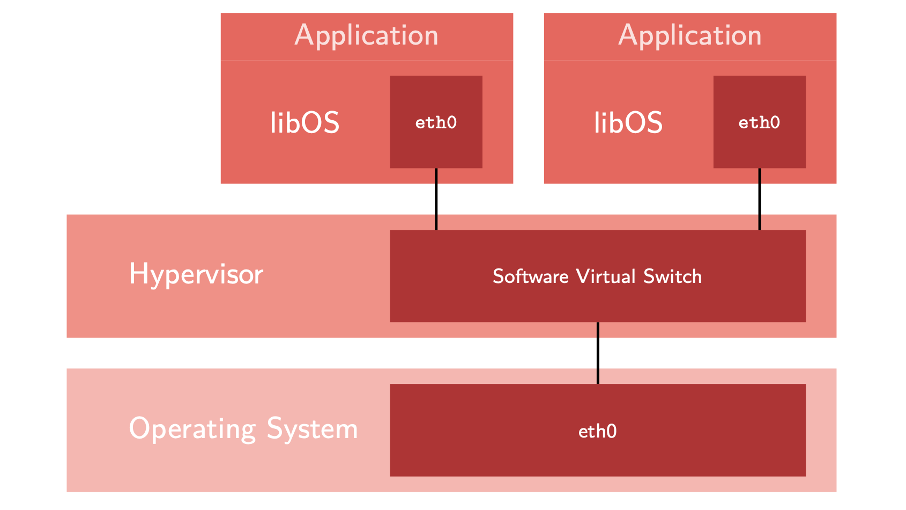

+++
title = "The <code>RustyHermit</code> Unikernel"
date = 2021-01-22

[extra]
authors = ["stlankes"]
+++

[RustyHermit](https://github.com/hermitcore/rusty-hermit) is a unikernel, which is completely written Rust. [Unikernels](http://unikernel.org/) are application images that directly contain the kernel as a library, so they do not require an installed operating system (OS). They are typical used in virtualized environments, which build the backbone of typical cloud / edge infrastructures.

<!-- more -->

<!-- showcase-intro -->

## Virtualization Designs

Common virtualized environments are based on classical **_virtual machines_**. In this case, complete machines are emulated or virtualized and common operating systems are running on both host and guest site:


This technique is established (VMware, Hyper-V, etc.) and widely used. However, it introduces additional overhead especially regarding memory consumption and performance.

An alternative approach to common virtual machines is **_OS-level
virtualization_**, where the kernel allows the existence of multiple
isolated user space instances. These isolated instances are also known
as container. A typical representative is LXC or Docker and promise less
overhead in comparison to common virtual machines. However, the
isolation between the processes is weaker and may provide less security.

## Unikernels

Often only one application (e.g. a web server) is running in the container or the virtual machine. In this case, a _unikernel_ is an attractive solution. The kernel is provided as static library and linked to the application. As the images directly contain the OS kernel, unikernels can directly be booted inside a virtual machine and do not require the typical software stack containing a Linux kernel and its userland within the VM.

Unikernels do not provide system calls in the classical sense, as everything is running with the privilege level of a kernel and what is typically done via system calls is provided via a common function call. At first glance, this sounds more insecure than previous approaches. However, these kernels are expected to run within a virtual machine, which isolates the application from the real system. In addition, common compiler analysis is used to check the complete software stack and unneeded components can even be removed, which can reduce the attack surface of the application.



Well known unikernels are kernels such as [MirageOS](https://mirage.io/)
and [Unikraft](http://www.unikraft.org/). MirageOS is written in OCaml,
while Unikraft still uses C as programming language. In contrast to these
kernels, RustyHermit is completely written in Rust to benefit from
Rust's performance and security behavior.

## RustyHermit

In principle, every existing
Rust application can be built on top of RustyHermit. However, unikernels
are a single tasking operating system. Consequently, the support of the
system call `fork` and inter-process communication are missing. In
addition, a classical C library is missing, which is typical used as
interface to the operating system. Every crate, which bypasses the
standard runtime and tries to communicate directly to operating system
does not work without modifications. However, many applications do not
depend on these features and work on RustyHermit.

### Performance

Unikernels can be highly optimized. For instance, we optimized the
network stack of RustyHermit. RustyHermit uses
[smoltcp](https://github.com/smoltcp-rs/smoltcp) as network stack, which
is completely written in Rust. As interface between guest and host
operating system, we use
[Virtio](https://www.linux-kvm.org/page/Virtio), which is in a
para-virtualized driver for KVM and widely used in virtualized Linux
environments.

The following figure compares Linux with RustyHermit,
where both are running as guests inside a virtual machine running on top
of a Linux-based host system:


Especially for small messages RustHermit
is faster in than Linux.

### Research

RustyHermit is also a research project to evaluate new operating
system designs, which improves the scalability and the security of operating systems in cloud environments. For instance, RustyHermit provides classical
techniques to improve the security behavior like stack guards and
separating the application stack from the libOS stack. However, a
library operating system typically uses a common function call to enter
the kernel. A classical separation of user- and kernel space by
entering a higher privilege level is missing.

We presented in a
[paper](https://www.ssrg.ece.vt.edu/papers/vee20-mpk.pdf) a modified
version of RustyHermit, which provides an intra-unikernel isolation with
_Intel Memory Protection Keys_ (MPK). MPK is a relatively new hardware
primitive that provides per-thread permission control over groups of
pages in a single address space with [negligible switching overhead](https://www.usenix.org/conference/atc19/presentation/park-soyeon),
making it a compelling candidate for use in unikernels.

MPK is requiring modification of page tables at a small performance cost. Four previously-unused bits of each page table entry (the 62nd to the 59th on x86-64) are exploited by MPK. Since MPK exploits four bits of the page table entry, it supports up to 15 protection keys.
MPK controls per-thread permission on groups of pages. Each core has a PKRU register (32 bits) containing a permission value. The value of the PKRU register defines the permission of the thread currently running on that core for each group of pages containing a protection key in their page table entries. Unlike page-table-level permission, MPK provides thread-local memory permission.

We provide user / kernel separation so we simply see the entire application as an untrusted component, independently of application-specific characteristics such as the language it is written in or the level of skill of the application’s programmer. In addition, we divide the kernel code into trusted and untrusted components. Trusted kernel components represent pieces of code written with a memory-safe language, i.e., offering strong security guarantees. Untrusted kernel components correspond to code written either in memory-unsafe languages or in unsafe Rust code blocks.

By entering the library operating system through the application binary interface the protection keys will be automatically changed, which allows access to the kernel stack and the kernel heap. Unauthorized access from within the application will trigger a pagefault, which will be handled by the library operating system.

### Example Project

To give you an example on how to build an RustyHermit application, lets create a new cargo project:

```sh
cargo new hello_world
cd hello_world
```

RustyHermit currently requires the nightly versions of the Rust toolchain.
To simplify the workflow, we recommend to create the configuration
_rust-toolchain_ as follows to define the required components and to
tested version of nightly compiler:

```toml
[toolchain]
channel = "nightly-2020-12-23"
components = [ "rustfmt", "rust-src", "llvm-tools-preview"]
targets = [ "x86_64-unknown-hermit" ]
```

The configuration file specifies the required components and the version of the nightly compiler to use.

The RustyHermit's target `x86_64-unknown-hermit` is part of Rust
supported platforms, but doesn't belong to the *tier 1* platforms,
which means that official binary releases aren't available and the
standard runtime must be build from scratch.
To simplify this build process, we recommend to create the configuration
file `.cargo/config` as follows:

```toml
[unstable]
build-std = ["std", "core", "alloc", "panic_abort"]

[build]
target = "x86_64-unknown-hermit"
```

To bind the library operating system to the application, we have to add the crate [`hermit-sys`](https://crates.io/crates/hermit-sys) to the dependencies in the file `Cargo.toml`:

```toml
# Cargo.toml

[target.'cfg(target_os = "hermit")'.dependencies]
hermit-sys = "0.1.*"
features = ["smoltcp"]
```

The feature `smoltcp` is required if your application tries
to establish a TCP connection. In this case, the library operating systems
includes the TCP/stack [smoltcp](https://github.com/smoltcp-rs/smoltcp).
In addition _hermit-sys_ depends on the tool [cargo-download](https://crates.io/crates/cargo-download) to download required components and must be installed with the command `cargo install cargo-download`.
Finally, the application can be build with the common command `cargo build`.

The result is a 64-bit excutable in the [executable link format](https://refspecs.linuxfoundation.org/elf/elf.pdf) (ELF).
To start the application within a common virtual machine, a loader is required, which initialize the processor and start the applications.
We provide a simple loader on [GitHub](https://github.com/hermitcore/rusty-loader).
A makefile to build the loader is part of the project.
After that, Qemu can be used to start RustyHermit in a VM as follows:

```sh
qemu-system-x86_64 -display none -smp 1 -m 64M -serial stdio  -kernel path_to_loader/rusty-loader -initrd path_to_app/app -cpu qemu64,apic,fsgsbase,rdtscp,xsave,fxsr
```

To improve the performance, KVM can be used to use the virtualization extension of modern processors.

```sh
qemu-system-x86_64 -display none -smp 1 -m 64M -serial stdio  -kernel path_to_loader/rusty-loader -initrd path_to_hello_world/hello_world -enable-kvm -cpu host
```

### Roadmap

For the near future, we plan to stabilize the interface to the hardware.
For instance, the support of [Virtio-fs](https://virtio-fs.gitlab.io/)
is in an early stage. In addition, the integration into Rust standard
library isn't finalized yet and the current version runs only on x86. In the
future, we want to also support aarch64 as processor architecture.
