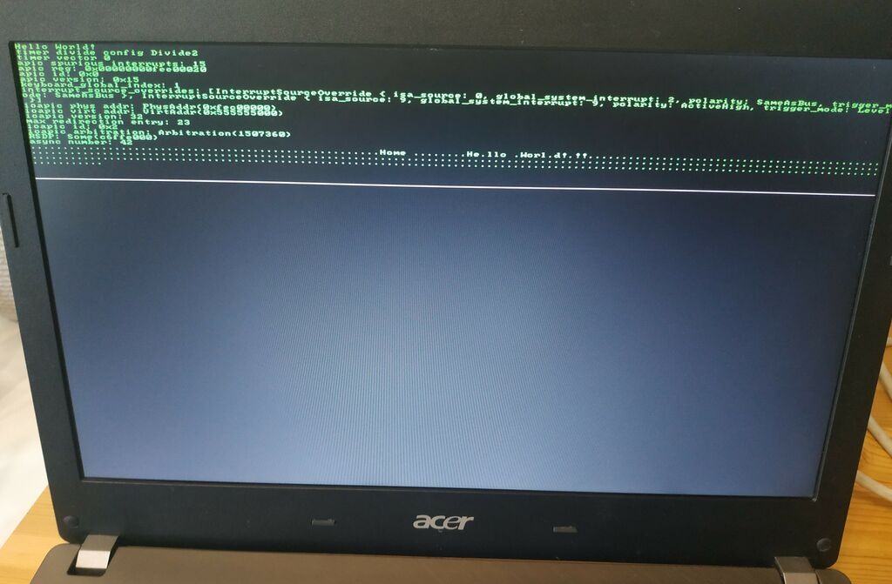

+++
title = "This Month in Rust OSDev (January 2021)"
date = 0000-01-01

[extra]
month = "January 2021"
authors = [
    "phil-opp",
    # add yourself here
]
+++

Welcome to a new issue of _"This Month in Rust OSDev"_. In these posts, we will give a regular overview of notable changes in the Rust operating system development ecosystem.

<!-- more -->

This series is openly developed [on GitHub](https://github.com/rust-osdev/homepage/). Feel free to open pull requests there with content you would like to see in the next issue. If you find some issues on this page, please report them by [creating an issue](https://github.com/rust-osdev/homepage/issues/new) or using our [_comment form_](#comment-form) at the bottom of this page.

<!--
    This is a draft for the upcoming "This Month in Rust OSDev (January 2021)" post.
    Feel free to create pull requests against the `next` branch to add your
    content here.
    Please take a look at the past posts on https://rust-osdev.com/ to see the
    general structure of these posts.
-->

## Showcase

We started a new [_Showcase_](https://rust-osdev.com/showcase/) section this month, where we introduce and present interesting Rust OSDev projects. The first post of this section is:

- [The `RustyHermit` Unikernel](https://rust-osdev.com/showcase/rusty-hermit/) written by [@stlankes](https://github.com/stlankes)

If you like to present your project too, just let us know!

## Project Updates

In this section, we give an overview of notable changes to the projects hosted under the [`rust-osdev`] organization.

[`rust-osdev`]: https://github.com/rust-osdev/about

### [`bootloader`](https://github.com/rust-osdev/bootloader)

The `bootloader` crate implements a custom Rust-based bootloader for easy loading of 64-bit ELF executables. While we didn't merge any commits to our `main` branch this month, we made good process on the [UEFI rewrite](https://github.com/rust-osdev/bootloader/pull/130):

- [Update uefi crate to v0.7.0](https://github.com/rust-osdev/bootloader/commit/06f41a28c3227ea28e3d99c12237461b92130d07)
- [Add bootloader version to boot info](https://github.com/rust-osdev/bootloader/commit/0c33cec02a897585bf21d21bac5e1e72854b0a18)
- [Make boot info FFI-safe](https://github.com/rust-osdev/bootloader/commit/86d1db72fd334e34dcfc17c78540b8365a974199)
- [Start providing API docs for all public items](https://github.com/rust-osdev/bootloader/commit/92b069a3414f423789e9921107120c7231608360)
- [Add a test that checks boot info values](https://github.com/rust-osdev/bootloader/commit/dc1267b73faeb40fd0ee33f03331f3439f545b34)
- [Create FAT file system image from `.efi` image](https://github.com/rust-osdev/bootloader/commit/2ac0c8260ca2838ec461ea3a390a383f3cc82958)
- [Create a GPT disk image with an UEFI boot partition](https://github.com/rust-osdev/bootloader/commit/c7828d311f25acc4b9929ce80aadbea197cf5dd0)
- [Only copy first level 4 entry to bootloader page table](https://github.com/rust-osdev/bootloader/commit/14c4e62adb6e05128755646d7fd5f6990a2385c9)

### [`acpi`](https://github.com/rust-osdev/acpi)

The `acpi` repository contains crates for parsing the ACPI tables – data structures that the firmware of modern
computers use to relay information about the hardware to the OS. In Januar, we added some updates to the `aml` crate:

- [Parse DefNoop](https://github.com/rust-osdev/acpi/commit/8b5b45795be895eab21a8c5b23978a0c4ce8f11f)
- [Parse DefBreakPoint](https://github.com/rust-osdev/acpi/commit/e4b49be7befca30dcc53b6b1a0c78793e928941a)
- [Implement DefAdd](https://github.com/rust-osdev/acpi/commit/2fec65aacf5ddc962c87274561f764beb4c69b33)
- [Fix lack of store in DefAnd](https://github.com/rust-osdev/acpi/commit/501b18023cc8c1f9ae0739ed5075df3ba9861b83)

### [`uart_16550`](https://github.com/rust-osdev/uart_16550)

The `uart_16550` crate provides basic support for serial port I/O for 16550-compatible UARTs. The crate received the following maintenance update in January:

- [Use stabilized `hint::spin_loop` instead of deprecated `atomic::spin_loop_hint`](https://github.com/rust-osdev/uart_16550/commit/cd497a98dabc66ba151218451d07f856950d443d)

### [`cargo-xbuild`](https://github.com/rust-osdev/cargo-xbuild)

The `cargo-xbuild` project provides `cargo` command wrappers to cross-compile the sysroot crates `core` and `alloc`. This month, we fixed an error that occurred in combination with the `XARGO_RUST_SRC` environment variable:

- [Ensure copied Cargo.lock is writable](https://github.com/rust-osdev/cargo-xbuild/pull/98) (published as `v0.6.5`)

Thanks to [@astro](https://github.com/astro) for this contribution!

Even though we still maintain the `cargo-xbuild` crate, we recommend switching to cargo's own `build-std` feature that is always up-to-date with the latest Rust/Cargo changes. We wrote a short guide on how to switch to it, which is available [in our Readme](https://github.com/rust-osdev/cargo-xbuild#alternative-the-build-std-feature-of-cargo).

## Personal Projects

In this section, we describe updates to personal projects that are not directly related to the `rust-osdev` organization. Feel free to [create a pull request](https://github.com/rust-osdev/homepage/pulls) with the updates of your OS project for the next post.

### [`phil-opp/blog_os`](https://github.com/phil-opp/blog_os)

(Section written by [@phil-opp](https://github.com/phil-opp))

We made good progress on the Persian and Japanese translations of the ["Writing an OS in Rust"](https://os.phil-opp.com/) blog this month:

- [Make index page translatable](https://github.com/phil-opp/blog_os/pull/899)
- [Improve multilingual support and Persian translation](https://github.com/phil-opp/blog_os/pull/901)
- [Persian translation of chapter Interrupts](https://github.com/phil-opp/blog_os/pull/904)
- [Fix layout of right-to-left in homepage and tables](https://github.com/phil-opp/blog_os/pull/896)
- [Adding tracking issue for Persian](https://github.com/phil-opp/blog_os/pull/909)
- [Translate post-04 to Japanese](https://github.com/phil-opp/blog_os/pull/903)
- [Translate common texts into Japanese](https://github.com/phil-opp/blog_os/pull/905)
- [Translate the index page to Japanese](https://github.com/phil-opp/blog_os/pull/907)

Thanks to [@hamidrezakp](https://github.com/hamidrezakp), [@MHBahrampour](https://github.com/MHBahrampour), [@woodyZootopia](https://github.com/woodyZootopia), and [@JohnTitor](https://github.com/JohnTitor) for creating the translations!

In addition to the new translations, we merged the following improvements:

- [Improve explanation for `BootInfoFrameAllocator::usable_frames`](https://github.com/phil-opp/blog_os/pull/897)
- [Added note to specify version 0.2.6 of volatile](https://github.com/phil-opp/blog_os/pull/910)
- [Remove unused import](https://github.com/phil-opp/blog_os/pull/898)
- [Fix typo](https://github.com/phil-opp/blog_os/pull/900)
- [Remove trailing comma in JSON example](https://github.com/phil-opp/blog_os/pull/912)
- [Fix memory address in self-referential struct example](https://github.com/phil-opp/blog_os/commit/cd8e139ab0e3c7cd47de1845c354fc7ddfad4887)

Thanks to [@delta1](https://github.com/delta1), [@NickSchmitt](https://github.com/NickSchmitt), [@nana0-0](https://github.com/nana0-0), and [@EvanMu96](https://github.com/EvanMu96) for these contributions!

#### Third Edition

As I already mentioned in the previous posts, I'm working on a new 3rd edition of the blog. The new edition will be compatible with UEFI, use a pixel-based framebuffer, and utilize the APIC instead of the legacy PIC for interrupt handling.

As mentioned above, we added support for UEFI disk image creation to the new `bootloader` version this month. This made it finally possible to start the rewritten `blog_os` code in UEFI mode on real hardware:

This is an old Acer TravelMate laptop of mine, booting from a USB stick. The output shows that it successfully sets up the local and IO-APIC for interrupt handling and then listens for timer and keyboard interrupts, just as before. The screen output is now based on a pixel-based framebuffer, using the [`font8x8`](https://docs.rs/font8x8/0.2.7/font8x8/) crate for simple font rendering. The memory management code required almost no changes, since the interface provided by the bootloader stayed almost the same (there are only some differences in the memory map format).

## Join Us?

Are you interested in Rust-based operating system development? Our `rust-osdev` organization is always open to new members and new projects. Just let us know if you want to join! A good way for getting in touch is our [gitter channel](https://gitter.im/rust-osdev/Lobby).

<!--
TODO: Update publication date
-->