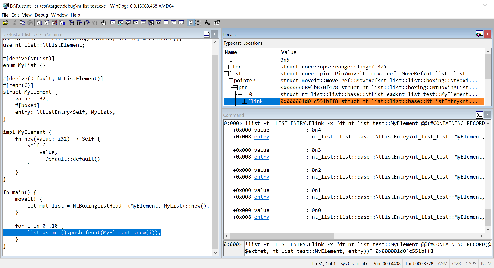

+++
title = "This Month in Rust OSDev: July 2022"
date = 0000-01-01

[extra]
month = "July 2022"
authors = [
    "phil-opp",
    "ColinFinck",
    # add yourself here
]
+++

Welcome to a new issue of _"This Month in Rust OSDev"_. In these posts, we give a regular overview of notable changes in the Rust operating system development ecosystem.

<!-- more -->

This series is openly developed [on GitHub](https://github.com/rust-osdev/homepage/). Feel free to open pull requests there with content you would like to see in the next issue. If you find some issues on this page, please report them by [creating an issue](https://github.com/rust-osdev/homepage/issues/new) or using our [_comment form_](#comment-form) at the bottom of this page.

<!--
    This is a draft for the upcoming "This Month in Rust OSDev (July 2022)" post.
    Feel free to create pull requests against the `next` branch to add your
    content here.
    Please take a look at the past posts on https://rust-osdev.com/ to see the
    general structure of these posts.
-->

## Project Updates

In this section, we give an overview of notable changes to the projects hosted under the [`rust-osdev`] organization.

[`rust-osdev`]: https://github.com/rust-osdev/about

### [`uefi-rs`](https://github.com/rust-osdev/uefi-rs)

Maintained by [@GabrielMajeri](https://github.com/GabrielMajeri), [@nicholasbishop](https://github.com/nicholasbishop), and [@phip1611](https://github.com/phip1611)

The `uefi` crate provides safe and performant wrappers for [UEFI](https://en.wikipedia.org/wiki/Unified_Extensible_Firmware_Interface), the successor to the BIOS.

We merged the following changes in July:

- [Protocol safety improvements](https://github.com/rust-osdev/uefi-rs/pull/460)
- [Add MemoryProtection protocol](https://github.com/rust-osdev/uefi-rs/pull/454)
- [`EqStrUntilNul` trait to compare Rust strings (`str`, `String`) against `CStr16` and `CString16`](https://github.com/rust-osdev/uefi-rs/pull/462)
- [cargo: additive panic-handler feature](https://github.com/rust-osdev/uefi-rs/pull/456) (_breaking_)
- [Allow qemu test to work under Windows without WSL](https://github.com/rust-osdev/uefi-rs/pull/463)
- [xtask: Fix channel of cargo operations](https://github.com/rust-osdev/uefi-rs/pull/466)
- [Improve entry macro tests](https://github.com/rust-osdev/uefi-rs/pull/471)

### [`x86_64`](https://github.com/rust-osdev/x86_64)

Maintained by [@phil-opp](https://github.com/phil-opp), [@josephlr](https://github.com/orgs/rust-osdev/people/josephlr), [@Freax13](https://github.com/orgs/rust-osdev/people/Freax13), and [@rybot666](https://github.com/orgs/rust-osdev/people/rybot666)

The `x86_64` crate provides various abstractions for `x86_64` systems, including wrappers for CPU instructions, access to processor-specific registers, and abstraction types for architecture-specific structures such as page tables and descriptor tables.

In July, we merged the following changes:

- [Add getters for the page table frame mapping](https://github.com/rust-osdev/x86_64/pull/385)
- [Release `v0.14.10`](https://github.com/rust-osdev/x86_64/pull/386)
- [Add missing IDT entries `#CP` and `#HV`](https://github.com/rust-osdev/x86_64/pull/387)

Thanks to [@Zildj1an](https://github.com/Zildj1an) for their contribution!

### [`xhci`](https://github.com/rust-osdev/xhci)

Maintained by [@toku-sa-n](https://github.com/toku-sa-n)

The `xhci` crate provides types of xHCI structires, such as Registers and TRBs.

We merged the following changes this month:

- [Remove the line number limitation](https://github.com/rust-osdev/xhci/pull/138)
- [feat: added `TryFrom<[u32; 4]>` to Command/Transfer TRB structs](https://github.com/rust-osdev/xhci/pull/137)
- [Release 0.8.5](https://github.com/rust-osdev/xhci/pull/139)
- [Fix `try_from!` macro not checking MSb of type](https://github.com/rust-osdev/xhci/pull/140)
- [Release 0.8.6](https://github.com/rust-osdev/xhci/pull/141)

Thanks to [@Demindiro](https://github.com/Demindiro) and [@ytoml](https://github.com/ytoml) for their contributions!

## Call for Participation

Want to contribute to a Rust OSDev project, but don't know where to start? Pick up one of these outstanding
issues in one of our projects and get started!

<!--
Please use the following template for adding items:
- [(`repo_name`) Issue Description](https://example.com/link-to-issue)
-->

- [(`rust-osdev/volatile`) Various improvements for the new design](https://github.com/rust-osdev/volatile/pull/28)

  We are currently discussing a new design for the `volatile` crate based on raw pointer types in order to avoid potential undefined behavior. The linked pull requests proposes an implementation where the volatile wrapper type is `Copy` and its methods take `self` by value. We haven't reached a decision yet, so if anyone has more input on this, please join the discussion. For more context, see also [PR #22](https://github.com/rust-osdev/volatile/pull/22).

If you maintain a Rust project related to operating system development and are looking for contributors, especially for tasks suited to people getting started in this space, please [create a PR](https://github.com/rust-osdev/homepage/pulls) against the `next` branch with the tasks you want to include in the next issue.

## Other Projects

In this section, we describe updates to Rust OS projects that are not directly related to the `rust-osdev` organization. Feel free to [create a pull request](https://github.com/rust-osdev/homepage/pulls) with the updates of your OS project for the next post.

### Comparison between [`phip1611/simple-chunk-allocator`](https://github.com/phip1611/simple-chunk-allocator) and [`rust-osdev/linked-list-allocator`](https://github.com/rust-osdev/linked-list-allocator)

(Section written by [@phip1611](https://github.com/phip1611))

In March 2022, Philipp Schuster proposed his [`simple-chunk-allocator`](https://github.com/phip1611/simple-chunk-allocator)
crate. It focuses on being a very simple-to-use general purpose allocator that "just works" for various workloads
in `no_std` context. However, there are other allocators, such as [`rust-osdev/linked-list-allocator`](https://github.com/rust-osdev/linked-list-allocator).
When you choose an allocator, you should not only consider the API and how to set it up, but actually the runtime 
characteristics. OS research has shown us that there is no perfect allocator. You can optimize an allocator for speed,
memory utilization (i.e., prevent fragmentation), code simplicity, and worst case execution time. There exist different
strategies to reach those goals: first-fit, next-fit, best-fit

Recently, Philipp benchmarked his `simple-chunk-allocator` against [`rust-osdev/linked-list-allocator`](https://github.com/rust-osdev/linked-list-allocator) 
to learn under which conditions which performs better. But at first, let's point out some differences. `simple-chunk-allocator` needs 
a static backing storage for heap and an additional static backing storage for its internal bookkeeping. `linked-list-allocator`
can solve this better by organizing the heap with the heap backing memory itself. `simple-chunk-allocator` uses a slightly
adjusted variant of best-fit that tries to reduce fragmentation. `linked-list-allocator` is a first-fit allocator that 
has a lower performance to more heap is used.

The relevant outcome is that `simple-chunk-allocator` always outperforms `linked-list-allocator` in median allocation time.
For stress tests with a low heap consumption, thus, no long stress test with 90% and more heap usage, `simple-chunk-allocator`
also outperforms `linked-list-allocator` in average allocation time. However, if the heap is full and frequent allocations
happen, the average (but not the median) allocation time of `linked-list-allocator` is better. Also, `linked-list-allocator`
can come close to 100% heap usage which is not the case for `simple-chunk-allocator`, because it suffers from internal
fragmentation under certain circumstances. Last but not least, even small allocations always takes up a multiple of the
used chunk size in `simple-chunk-allocator`.

In the end, there is no optimal allocator. You must choose which properties are more relevant for your scenario.
For concrete measurements, please head to the README of [`simple-chunk-allocator`](https://github.com/phip1611/simple-chunk-allocator).

### [`nt-list`: Windows Linked Lists in idiomatic Rust](https://colinfinck.de/posts/nt-list-windows-linked-lists-in-idiomatic-rust/)

(Section written by [@ColinFinck](https://github.com/ColinFinck))

On his quest to develop a ReactOS/Windows bootloader in Rust, Colin Finck released another building block as a reusable `no_std` crate this month.
After [nt-hive](https://github.com/ColinFinck/nt-hive) for reading Windows registry hive files and [ntfs](https://github.com/ColinFinck/ntfs) to access Microsoft's proprietary NTFS filesystem, the [nt-list](https://github.com/ColinFinck/nt-list) crate provides a type-safe and idiomatic Rust interface to work with Windows Linked Lists, known as [`LIST_ENTRY`](https://docs.microsoft.com/en-us/windows/win32/api/ntdef/ns-ntdef-list_entry) and [`SINGLE_LIST_ENTRY`](https://docs.microsoft.com/en-us/windows/win32/api/ntdef/ns-ntdef-single_list_entry).
This is what Windows, Windows drivers, and components influenced by Windows (e.g. UEFI) have been using for a long time to uniformly handle linked lists.

[Colin's blog post](https://colinfinck.de/posts/nt-list-windows-linked-lists-in-idiomatic-rust/) goes into detail about some of the differences between textbook and Windows linked lists and the challenges in coming up with a safe Rust implementation.
The final interface provided by nt-list is as simple to use as `Vec` while being fully compatible to the original `LIST_ENTRY`.
The compatibility is proven in a WinDbg debugging session:

If you want to give it a spin, the crate is available on [crates.io](https://crates.io/crates/nt-list), and make sure to also check the [docs](https://docs.rs/nt-list/).

### [`phil-opp/blog_os`](https://github.com/phil-opp/blog_os)

(Section written by [@phil-opp](https://github.com/phil-opp))

This month, ...

### [Theseus OS](https://github.com/theseus-os/Theseus)

(Section written by [Kevin Boos](https://www.theseus-os.com/kevinaboos/) ([@kevinaboos](https://github.com/kevinaboos))

Theseus is a safe-language OS written from scratch in Rust that is in the process of migrating from pure academic research objectives to more general usability and legacy compatibility.

Theseus dynamically loads and links all components at runtime, and executes everything in a single address space and at a single privilege level.
With this, Theseus employs *intralingual* design principles to maximally leverage the strengths of the Rust language, allowing the compiler to both view and semantically understand (and thus extend its safety checks to) all components from top-level apps to low-level kernel entities.
Theseus strives to not only ensure isolation between different entity components and subsystems in the OS, but also to go further than language safety to provide various invariants that guarantee properties about most system-provided types.
For more, check out [the Theseus OS Book](https://www.theseus-os.com/Theseus/book/index.html) or our [academic papers and presentations](https://www.theseus-os.com/Theseus/book/misc/papers_presentations.html).

Theseus is fully open-source and always welcomes [contributions](https://www.theseus-os.com/Theseus/book/contribute/contribute.html) from anyone.

Over the past month (or two), Theseus OS made significant progress on a variety of topics:
* Finished the first known port of Wasmtime to `no_std`, enabling us to [run WASM binary workloads on Theseus](https://github.com/theseus-os/Theseus/pull/556) with relative ease.
    * Importantly, this overcomes the classic limitation of safe-language OSes -- that all components must be written in that safe language -- to allow unsafe (e.g., C, C++) programs to run on Theseus in a sandboxed WASM environment.
    * See our [blog post with more info](https://www.theseus-os.com/2022/06/21/wasmtime-complete-no_std-port.html) on this endeavor.
* Thanks to funding from Futurewei Technologies, Theseus Systems [hired two developers](https://www.theseus-os.com/2022/04/29/Theseus-Is-Hiring.html) to work on Theseus's next several milestones, [Nathan Royer](https://github.com/NathanRoyer) and [Klim Tsoutsman](https://github.com/tsoutsman/).,
    * Thanks to everyone who reached out to us and participated in interviews; we received a lot more interest than expected!
* Began work on porting the Rust `std` library to Theseus.
* Designed a [completely new configuration interface based on cargo features](https://github.com/theseus-os/Theseus/pull/522), which enables one to easily include or exclude specific Theseus crates in a build of Theseus, but in a safe, dependency-aware manner.
* Significantly improved speed and memory usage of our runtime loader and linker:
    * Introduced a [custom linker script and linker pass](https://github.com/theseus-os/Theseus/pull/562) that performs partial relinking of object files to merge their per-function/per-data sections together.
        * This results in a **30-40%** reduction in object file size and a **15-18x** improvement in loading/linking times. For example, loading and linking the full Wasmtime project (60+ crates) now takes ~100ms instead of 15 seconds.
    * [De-duplicated strings in our metadata](https://github.com/theseus-os/Theseus/pull/549) related to crate loading, which reduces heap usage by about 20%.
* Added support for [booting Theseus using the `limine` bootloader](https://github.com/theseus-os/Theseus/pull/541) and for [building Theseus on non-Debian Linux distributions like Fedora](https://github.com/theseus-os/Theseus/pull/536).
* Improved support for the [IXGBE ethernet NIC](https://github.com/theseus-os/Theseus/pull/523).
* [Sped up post-`rustc` build steps by about 15-20 seconds](https://github.com/theseus-os/Theseus/pull/565) with simple Makefile loop parallelization.

Check out the [Theseus OS blog](https://www.theseus-os.com/) for the latest details.

## Join Us?

Are you interested in Rust-based operating system development? Our `rust-osdev` organization is always open to new members and new projects. Just let us know if you want to join! A good way for getting in touch is our [gitter channel](https://gitter.im/rust-osdev/Lobby).

<!--
TODO: Update publication date
-->
