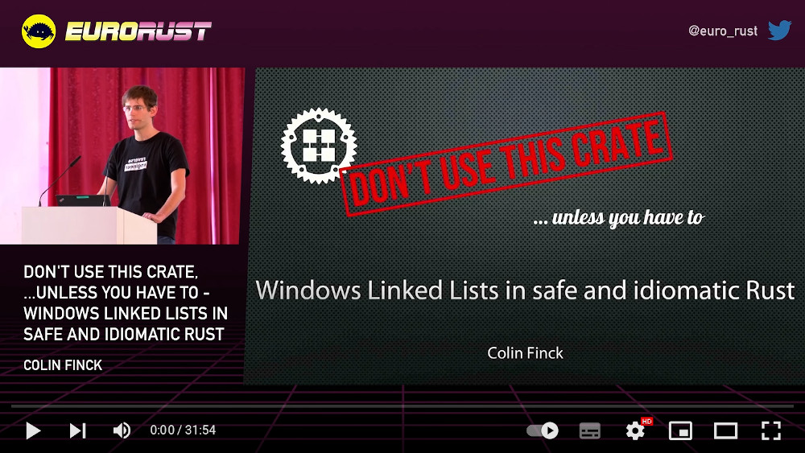

+++
title = "This Month in Rust OSDev: October 2022"
date = 0000-01-01

[extra]
month = "October 2022"
editors = ["phil-opp"]
+++

Welcome to a new issue of _"This Month in Rust OSDev"_. In these posts, we give a regular overview of notable changes in the Rust operating system development ecosystem.

<!-- more -->

This series is openly developed [on GitHub](https://github.com/rust-osdev/homepage/). Feel free to open pull requests there with content you would like to see in the next issue. If you find some issues on this page, please report them by [creating an issue](https://github.com/rust-osdev/homepage/issues/new) or using our [_comment form_](#comment-form) at the bottom of this page.

<!--
    This is a draft for the upcoming "This Month in Rust OSDev (October 2022)" post.
    Feel free to create pull requests against the `next` branch to add your
    content here.
    Please take a look at the past posts on https://rust-osdev.com/ to see the
    general structure of these posts.
-->

## `rust-osdev` Projects

In this section, we give an overview of notable changes to the projects hosted under the [`rust-osdev`] organization.

[`rust-osdev`]: https://github.com/rust-osdev/about

<!--
    Please use the following template:

    ### [`repo_name`](https://github.com/rust-osdev/repo_name)
    Maintained by [@maintainer_1](https://github.com/maintainer_1)

    The `repo_name` crate ...<<short introduction>>...

    We merged the following changes this month:
    <<changelog, either in list or text form>>
-->

### [`bootloader`](https://github.com/rust-osdev/bootloader)
Maintained by [@phil-opp](https://github.com/phil-opp), [@rybot666](https://github.com/rybot666), and [@64](https://github.com/64)

- [allow booting without a UEFI graphics output](https://github.com/rust-osdev/bootloader/pull/268)
- [fb/logger: bump noto-sans-mono-bitmap + improvements](https://github.com/rust-osdev/bootloader/pull/267)
- [implement read-only relocations](https://github.com/rust-osdev/bootloader/pull/269)

Thanks to [@phip1611](https://github.com/phip1611), and [@Freax13](https://github.com/Freax13) for their contributions!

### [`linked-list-allocator`](https://github.com/rust-osdev/linked-list-allocator)
Maintained by [@phil-opp](https://github.com/phil-opp) and [@jamesmunns](https://github.com/jamesmunns)

- [random action fuzzer](https://github.com/rust-osdev/linked-list-allocator/pull/69)
- [Run new cargo-fuzz job on CI with time limit](https://github.com/rust-osdev/linked-list-allocator/pull/72)
- [Consider regions that lead to very small back paddings as unsuitable](https://github.com/rust-osdev/linked-list-allocator/pull/71)

Thanks to [@evanrichter](https://github.com/evanrichter), and [@phil-opp](https://github.com/phil-opp) for their contributions!

### [`acpi`](https://github.com/rust-osdev/acpi)
Maintained by [@IsaacWoods](https://github.com/IsaacWoods)

- [Add Debug implementations](https://github.com/rust-osdev/acpi/pull/128)
- [rework crate to allocationless](https://github.com/rust-osdev/acpi/pull/131)

Thanks to [@semiviral](https://github.com/semiviral), and [@mattfbacon](https://github.com/mattfbacon) for their contributions!

### [`uefi-rs`](https://github.com/rust-osdev/uefi-rs)
Maintained by [@GabrielMajeri](https://github.com/GabrielMajeri), [@nicholasbishop](https://github.com/nicholasbishop), and [@phip1611](https://github.com/phip1611)

- [Copy license file to uefi-macros and uefi-services](https://github.com/rust-osdev/uefi-rs/pull/520)
- [Fix clippy lint by removing unnecessary cast](https://github.com/rust-osdev/uefi-rs/pull/525)
- [Update documentation section of readme](https://github.com/rust-osdev/uefi-rs/pull/519)
- [uefi-services: Change panic handler log message.](https://github.com/rust-osdev/uefi-rs/pull/526)
- [Fix warning from unneeded `macro_use`](https://github.com/rust-osdev/uefi-rs/pull/527)
- [Add option to disable network tests](https://github.com/rust-osdev/uefi-rs/pull/528)
- [Change `Event` to be FFI-safe using `NonNull`](https://github.com/rust-osdev/uefi-rs/pull/507)
- [Add `guid!` macro](https://github.com/rust-osdev/uefi-rs/pull/536)
- [Add Guid methods to convert to/from byte arrays](https://github.com/rust-osdev/uefi-rs/pull/535)
- [Tweak pull request template wrapping](https://github.com/rust-osdev/uefi-rs/pull/533)
- [ci: Simplify some jobs with ubuntu-22.04 runner](https://github.com/rust-osdev/uefi-rs/pull/532)
- [Fix clippy warnings](https://github.com/rust-osdev/uefi-rs/pull/538)
- [Fixes and improvements for `Revision`](https://github.com/rust-osdev/uefi-rs/pull/529)
- [Replace `UnalignedCStr16` with `UnalignedSlice`](https://github.com/rust-osdev/uefi-rs/pull/539)
- [Add new `DeviceSubType` values](https://github.com/rust-osdev/uefi-rs/pull/537)

Thanks to [@nicholasbishop](https://github.com/nicholasbishop), [@timrobertsdev](https://github.com/timrobertsdev), and [@raccog](https://github.com/raccog) for their contributions!

## Call for Participation

Want to contribute to a Rust OSDev project, but don't know where to start? Help with one of these outstanding issues!

<!--
    Please use the following template for adding items:
    - [(`repo_name`) Issue Description](https://example.com/link-to-issue)
-->

If you maintain a Rust project related to operating system development and are looking for contributors, especially for tasks suited to people getting started in this space, please [create a PR](https://github.com/rust-osdev/homepage/pulls) against the `next` branch with the tasks you want to include in the next issue.

## Other Projects

In this section, we describe updates to Rust OS projects that are not directly related to the `rust-osdev` organization. Feel free to [create a pull request](https://github.com/rust-osdev/homepage/pulls) with the updates of your OS project for the next post.

<!--
    Please use the following template:

    ### [`owner_name/repo_name`](https://github.com/rust-osdev/owner_name/repo_name)
    (Section written by [@your_github_name](https://github.com/your_github_name))

    ...<<your project updates>>...
-->

### [`d-sonuga/blog-blasterball`](https://github.com/d-sonuga/blog-blasterball/)
(Section written by [@d-sonuga](https://github.com/d-sonuga))

[Demilade Sonuga's Blog](https://d-sonuga.netlify.app/) is a new blog on writing a
simple blasterball game with no OS, no engine and minimal external crates. The blog's aim is to take a Rust
beginner from starting the project to finishing it and understanding everything involved in the project's
creation.

The project is still in it's early stages, so lots of feedback is very much needed.

If you're interested, please take a look, and send your thoughts to [@d_sonuga](https://twitter.com/d_sonuga/)
on Twitter.

### Talk on Windows Linked Lists in safe and idiomatic Rust
(Section written by [@ColinFinck](https://github.com/ColinFinck))

At the first ever EuroRust conference from 13th to 14th October, Colin Finck gave a talk about the challenges of developing his [nt-list](https://github.com/ColinFinck/nt-list) crate.
The crate provides a safe and idiomatic Rust wrapper around the Windows variant of Linked Lists.
It was presented on this blog [in July](/this-month/2022-07/#nt-list-windows-linked-lists-in-idiomatic-rust).

A recording of the talk has just been uploaded.
Check it out, and also check out the [other videos](https://www.youtube.com/channel/UCR3gXcme1HMK7_TrUaNZOqw/videos) from that conference for some great takes on Rust!

## Join Us?

Are you interested in Rust-based operating system development? Our `rust-osdev` organization is always open to new members and new projects. Just let us know if you want to join! A good way for getting in touch is our [gitter channel](https://gitter.im/rust-osdev/Lobby).

<!--
TODO: Update publication date
-->
